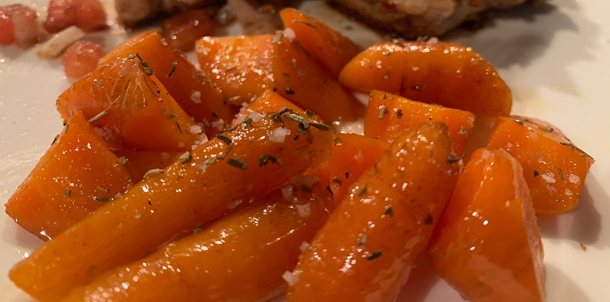

Another one from Thomas Keller's Master Class, this is close to his [technique for glazing carrots](https://www.masterclass.com/classes/thomas-keller-teaches-cooking-techniques/chapters/glazing-carrots). They were delicous! I also made a video of the process, which included making some sauce vierge.

## What to Improve

The flavor and texture of these were great, so I'll work on getting more consistent sizes next time.

## Lights, Camera, Action

<iframe src="https://player.vimeo.com/video/331557061?title=0&byline=0&portrait=0" width="736" height="414" frameborder="0" allow="autoplay; fullscreen" allowfullscreen></iframe>

