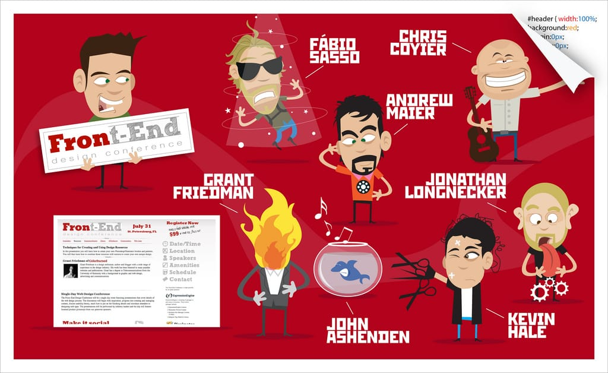
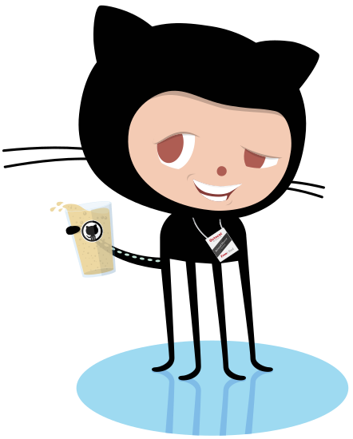

  
 
 Before I get to the future, I'll share a tidbit about the past. When I first got Cherrie's approval for doing the 2009 event, I wasn't thinking about 5 years down the road. I wasn't even thinking beyond the day of the first event. Jumping out there and just doing it was one of the best decisions I've made. However, trying to just do something cool without a plan leads to some issues. The result of this has been that every year after the event we talk about how it went and then decide if we can do it again. Going into our fifth year, I don't want to have that conversation afterwards. The last event was by far my favorite. Hanging out with people beforehand, the fantastic presentations of the day, dressing up in goofy stuff for the photo booth, air guitar on a chair during karaoke, the day 2 speakers and the conversations Saturday night absolutely rocked. The awesome sponsors made the amenities great and the whole thing went wonderfully. In our final review, we knew that we want to run this event for as long as people are interested in coming. I love what the conference has become and (in considering future events) my number one goal is not to break it.

### Scaling, Sponsors and Budget 

As we've grown into an event that has sold out at 200 and 250 available registrations, the first question is "do we continue growing?" Considering my goal of 'not breaking it', I don't plan to raise the number of available spots, at least for 2013\. With all of the registrations, speakers, sponsors and our awesome team it ends up close to 300 people. That size felt really right, so we're going to tweak how we handle the student tickets but keep things at the same 300 people level. The awesome companies that have sponsored the conference have absolutely carried us through. If it weren't for the sponsors in the first 2 years, we wouldn't have been able to continue. Luckily, we learned a few things in those 2 and tweaked sponsorship funds to go to the fun extras like t-shirts, notepads, chocolate covered bacon and free after party drinks. The level of all these things felt great in 2012. Both of those two combine into the "big one": the budget. The first couple of years ran in the red, but each of the second two were able to stay in the black. Overall, it's still red but the black trend is enough to keep going on. Everything about 2012 felt right and we want to be able to deliver that level of experience every year. There's always room for more extras, but we wouldn't want to take things away. The problem is that without the sponsors, it would have been in the red. So, we're going to adjust the pricing this year. 

### Price Changes 

To make sure that we have enough to cover the expenses, we need to raise the price by approximately $30 per person for half of the attendees. This made for an interesting decision: do we keep the early bird at $119 and raise the main price to $179 or just bring the early bird up to $149? Always trying to be as fair as possible, I would prefer for everyone to have the same cost than a $60 difference. Plus the early bird is usually 100 vs. 150, so it's raising the price on less people. We're going to make it one flat rate of $149. The only discount that we will have is that we will offer up to 25 spots as student tickets at our usual $99\. In the past, we have done this just for Full Sail students, but we have found more interested people. This year we will open it up to the first 25 students. This will ensure that we can run the event at the same level as 2012\. Of course, we will look for sponsors that want to make the day even better. Cherrie always has great ideas for making things special. 

### A less important fix 

 

The logo has plagued me since 2009\. As part of not thinking beyond the day of the first event, I made the "logo" to match the site. The original site (which I scared myself by looking at a few weeks ago) was normal on the left and used sketches and sketched type on the right. It was supposed to look unfinished as it technically was. It changed as things changed in the few months while we planned that first event. People have asked me many times about why the sketched part begins at the 't'. I don't have a good answer, it was just closer to being half. Either way, it's going away. [Ricardo Gimenes'](http://ricardogimenes.com) work with the characters is the true branding, so I'm just going to start using a web font to make the Front-End a solid red. Whew. 

### Excited for 2013 

I have some ideas for 2013\. First off, I'm going to to get the topics in a timely manner. Speakers and topics will be available when the site launches, which will be early '13\. Luckily, I had lightly discussed speaking with a full lineup before 2012 even ran. I'm also going to [completely rip off Chris Coyier](http://css-tricks.com/lodge) and screencast the realign. I'm pretty happy with the overall look of the site, but not the performance. I'll be converting the site to Haml, Sass and Compass, improving the small screen experience and making design decisions along the way. I'm certainly no Mr. Coyier in either skill or charisma, but I think it will be fun to share the techniques in building the site. We're also going to have an optional workshop on the Thursday before the big day. I have wanted to run one for the last couple of years, but finally found the right fit to make it work. More on that later… It is totally not official, but we are looking at June 21st and 22nd for 2013\. Boom!