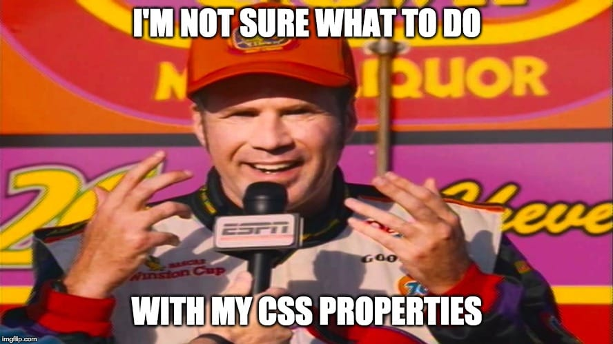
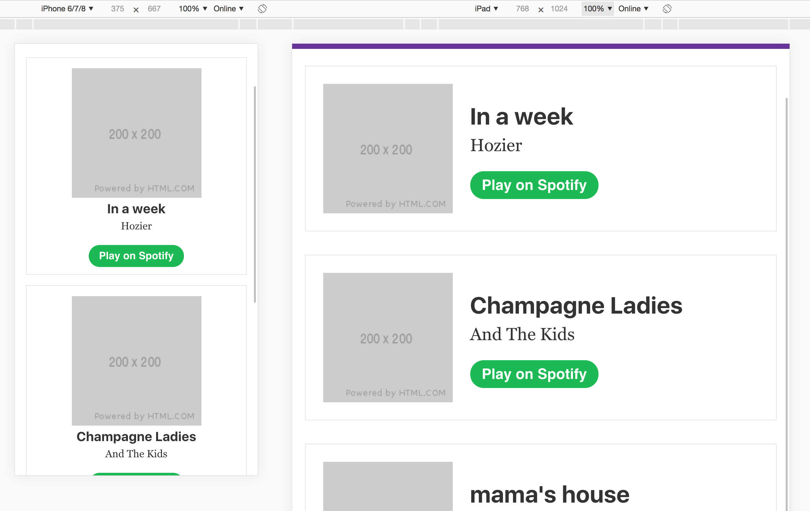

While the title is about the CSS-in-JS package named [Emotion](https://emotion.sh/docs/introduction), I will say that I haven't been this excited about front-end development for quite a while. I'm all-in on the JAMstack, building in [Gatsby](https://www.gatsbyjs.org) daily at work and I just revamped my site with it as well. It's by far the fastest and most technically advanced version that I've ever made and I hardly did a thing besides format markdown. The beneits come from the people behind the project, so I get to keep learning the fundamentals of ES6, JSX, and React.

## We get so much for free

I mean free both literally and figuratively. Storing the source code for my site costs zero money, as does hosting it on the [Netlify](https://www.netlify.com) servers that you're reading this from right now. I'd pay for both in an instant, but the free plans cover my needs. More importantly, we get so much work for "free". I've done my fair share of complaining about the complexity of tooling in modern front-end development, but by skimming a few `README` files and typing a few `npm` commands, we get to use the most advanced versions of JavaScript, minification, tree-shaking, image-optimization, lazy-loading, pre-loading of assets, etc. A screenshot is worth a thousand made-up tech words, so we get to run audits with throttled 3g that blow straight 100s, for free.

## Getting Emotion-al

I know the CSS-in-JS is a hot-topic, so for the record, I love CSS. I started writing "styles" before CSS stylesheets were "the way" and we were only inlining HTML attributes. There are few things more satisfying than adding some properties and changing the way things look in a browser. Since adopting stylesheets, though, I (and nearly everyone else) have been trying to figure out ways to reduce the amount of CSS I write, the lines of CSS that I have to look through to find CSS I've written, and the amount that I serve to visitors.

I've seen some creative solutions to all 3, and one that stands out is that back in the day, the Wufoo team built a system in PHP that served up a dedicated CSS file per page throughout their app. That took some work from the team to develop and maintain, and I'm not sure if they were minifying and gzipping at that point. If they were, they had to figure out their own way of automating those things. Nowadays, that's like 3 `npm install`s that you can probably chain if you're into that kind of thing.

As one of only a handful of front-end engineers in an engineering team of ~30, I put a lot of emphasis on minimizing the CSS that I write and that my team members have to write. We rely heavily on ["utility-first CSS"](https://frontstuff.io/in-defense-of-utility-first-css) within our design system for that. If utility classes make you angry, it's ok, no one's perfect 😜. With our approach, we only need to write CSS for items that are highly custom (and out of the design system bounds) or for elements that change across viewport sizes. (We do use some responsive utilities as well, but the scale of them gets too large for everything in your CSS treasure chest.) It has been a challenge to figure out a sustainable way to add CSS to a project and to add CSS to components that we want to share across projects. I (read we) think that a styled components approach is the way to go, and Emotion appealed to us more than the styled-components package. So, I used it as an excuse to rebuild my site in Emotion.

## Everyone has a plan until they try organizing CSS-in-JS

Once you get past the weirdness of creating elements as "components" that you only write CSS in, things get awkward. I feel like the Ricky Bobby of front-end dev.



I'll use a basic card layout as an example to show the organization options, including hovers and media queries. (Yeah, we could do a lot of that with some responsive typography solutions and Grid, but there would still have to be some CSS.)



[All 3 examples are in a Gatsby Starter if you want to play](https://github.com/dandenney/example-gatsby-emotion).

### My least favorite (in one context)

The CSS prop is my least favorite for static styles that only change based on the viewport. That said, it's valuable for [dynamically altering styles](https://twitter.com/kyehohenberger/status/1083933849975803904). It's too close to inline styles for my taste and scannability of a file degrades quickly. (Don't worry, you'll only have to scroll for like 30 seconds)

```jsx
import React from 'react';
import { Link } from 'gatsby';

import { songs } from '../data/songs';

import Layout from '../components/layout';

/** @jsx jsx */
import { css, jsx } from '@emotion/core';

const PropsPage = () => (
  <Layout>
    <section>
      {songs.map(({ imgUrl, title, artist, playUrl }) => (
        <article
          css={css`
            border: 1px solid #e5e5e5;
            padding: 1rem;
            text-align: center;

            &:not(:first-of-type) {
              margin-top: 1rem;
            }

            @media screen and (min-width: 600px) {
              align-items: center;
              display: flex;
              padding: 1.5rem;
              text-align: left;

              &:not(:first-of-type) {
                margin-top: 2rem;
              }
            }
          `}
        >
          
          <div
            css={css`
              @media screen and (min-width: 600px) {
                padding-left: 1.5rem;
              }
            `}
          >
            <h3
              css={css`
                font-size: 1.25rem;
                margin: 0 0 0.25rem 0;

                @media screen and (min-width: 600px) {
                  font-size: 2rem;
                  margin: 0 0 0.75rem 0;
                }
              `}
            >
              {title}
            </h3>
            <p
              css={css`
                @media screen and (min-width: 600px) {
                  font-size: 1.5rem;
                  margin-bottom: 2rem;
                }
              `}
            >
              {artist}
            </p>
            <a
              css={css`
                background: #1db954;
                border-radius: 24px;
                color: #fff;
                font-family: sans-serif;
                font-weight: bold;
                padding: 0.5rem 1rem;
                text-decoration: none;
                transition: background-color 0.3s ease-in-out;

                &:hover {
                  backround-color: #4bdf80;
                }

                @media screen and (min-width: 600px) {
                  font-size: 1.25rem;
                }
              `}
              href={playUrl}
            >
              Play on Spotify
            </a>
          </div>
        </article>
      ))}
    </section>

    <nav
      css={css`
        margin: 2rem 0;
      `}
    >
      <Link
        css={css`
          margin-right: 1rem;
        `}
        to="/"
      >
        Prop Version
      </Link>
      <Link
        css={css`
          margin-right: 1rem;
        `}
        to="/styled/"
      >
        Styled Version
      </Link>
      <Link to="/import/">Import Version</Link>
    </nav>
  </Layout>
);

export default PropsPage;
```

### My favorite that I've tried before this post

As I rebuilt my site, using the `styled` package and creating elements was more comfortable. It groups the styles in one area, but separate from the markup, and you can divide them into sub-groups. It does reduce the overall scannability of the file, but I think I was used to that from the time that I spent in Vue, so it still felt normal. Spoiler: I have a new favorite.

```jsx
import React from 'react';
import { Link } from 'gatsby';

import { songs } from '../data/songs';

import Layout from '../components/layout';

import styled from '@emotion/styled';

const StyledPage = () => (
  <Layout>
    <section>
      {songs.map(({ imgUrl, title, artist, playUrl, Nav }) => (
        <Song>
          
          <Wrapper>
            <Title>{title}</Title>
            <Artist>{artist}</Artist>
            <Play href={playUrl}>Play on Spotify</Play>
          </Wrapper>
        </Song>
      ))}
    </section>

    <Nav>
      <Link to="/">Prop Version</Link>
      <Link to="/styled/">Styled Version</Link>
      <Link to="/import/">Import Version</Link>
    </Nav>
  </Layout>
);

const Song = styled.article`
  border: 1px solid #e5e5e5;
  padding: 1rem;
  text-align: center;

  &:not(:first-of-type) {
    margin-top: 1rem;
  }

  @media screen and (min-width: 600px) {
    align-items: center;
    display: flex;
    padding: 1.5rem;
    text-align: left;

    &:not(:first-of-type) {
      margin-top: 2rem;
    }
  }
`;

const Img = styled.img`
  margin: 0;
`;

const Wrapper = styled.div`
  @media screen and (min-width: 600px) {
    padding-left: 1.5rem;
  }
`;

const Title = styled.h3`
  font-size: 1.25rem;
  margin: 0 0 0.25rem 0;

  @media screen and (min-width: 600px) {
    font-size: 2rem;
    margin: 0 0 0.75rem 0;
  }
  font-size: 1.25rem;
  margin: 0 0 0.25rem 0;

  @media screen and (min-width: 600px) {
    font-size: 2rem;
    margin: 0 0 0.75rem 0;
  }
`;

const Artist = styled.p`
  @media screen and (min-width: 600px) {
    font-size: 1.5rem;
    margin-bottom: 2rem;
  }
`;

const Play = styled.a`
  background: #1db954;
  border-radius: 24px;
  color: #fff;
  font-family: sans-serif;
  font-weight: bold;
  padding: 0.5rem 1rem;
  text-decoration: none;
  transition: background-color 0.3s ease-in-out;

  &:hover {
    backround-color: #4bdf80;
  }

  @media screen and (min-width: 600px) {
    font-size: 1.25rem;
  }
`;

const Nav = styled.nav`
  margin: 2rem 0;

  a:not(:first-of-type) {
    margin-left: 1rem;
  }
`;

export default StyledPage;
```

### Smarter people have smarter options

I reviewed a bunch of repos and [tweeted](https://twitter.com/dandenney/status/1118259679308779521) to see what other people were doing. [Mr. Powers shared a sensible approach](https://twitter.com/_drewpowers/status/1118273699138940933) for importing the styled components from a separate file. This seems like a more clean approach than keeping them in a single file. In this, I'm coupling a single file to single "page" component, but you could technically break out each styled child component to a single file if you like minimal files.

#### import.js page

```jsx
import React from 'react';
import { Link } from 'gatsby';

import { songs } from '../data/songs';

import Layout from '../components/layout';
import {
  Song,
  Img,
  Wrapper,
  Title,
  Artist,
  Play,
  Nav,
} from '../components/separate';

const ImportPage = () => (
  <Layout>
    <section>
      {songs.map(({ imgUrl, title, artist, playUrl }) => (
        <Song>
          
          <Wrapper>
            <Title>{title}</Title>
            <Artist>{artist}</Artist>
            <Play href={playUrl}>Play on Spotify</Play>
          </Wrapper>
        </Song>
      ))}
    </section>

    <Nav>
      <Link to="/">Prop Version</Link>
      <Link to="/styled/">Styled Version</Link>
      <Link to="/import/">Import Version</Link>
    </Nav>
  </Layout>
);

export default ImportPage;
```

#### import.js components

```jsx
import React from 'react';
import styled from '@emotion/styled';

export const Song = styled.article`
  border: 1px solid #e5e5e5;
  padding: 1rem;
  text-align: center;

  &:not(:first-of-type) {
    margin-top: 1rem;
  }

  @media screen and (min-width: 600px) {
    align-items: center;
    display: flex;
    padding: 1.5rem;
    text-align: left;

    &:not(:first-of-type) {
      margin-top: 2rem;
    }
  }
`;

export const Img = styled.img`
  margin: 0;
`;

export const Wrapper = styled.div`
  @media screen and (min-width: 600px) {
    padding-left: 1.5rem;
  }
`;

export const Title = styled.h3`
  font-size: 1.25rem;
  margin: 0 0 0.25rem 0;

  @media screen and (min-width: 600px) {
    font-size: 2rem;
    margin: 0 0 0.75rem 0;
  }
  font-size: 1.25rem;
  margin: 0 0 0.25rem 0;

  @media screen and (min-width: 600px) {
    font-size: 2rem;
    margin: 0 0 0.75rem 0;
  }
`;

export const Artist = styled.p`
  @media screen and (min-width: 600px) {
    font-size: 1.5rem;
    margin-bottom: 2rem;
  }
`;

export const Play = styled.a`
  background: #1db954;
  border-radius: 24px;
  color: #fff;
  font-family: sans-serif;
  font-weight: bold;
  padding: 0.5rem 1rem;
  text-decoration: none;
  transition: background-color 0.3s ease-in-out;

  &:hover {
    backround-color: #4bdf80;
  }

  @media screen and (min-width: 600px) {
    font-size: 1.25rem;
  }
`;

export const Nav = styled.nav`
  margin: 2rem 0;

  a:not(:first-of-type) {
    margin-left: 1rem;
  }
`;
```

## Getting there

Of the options that I've found so far, importing styles seems like the best. However, I still have lots of organization questions. Here are a few:

- Do we name the files styles? If so, is `styles` a folder of its own with folders or do we make a folder for every page and component, with the styles file in there? (This heads down the very popular project organization debate)
- How do you separate styles for pages vs. components?
- When you're exporting a component, how to handle the exported component name vs. the top-level element name? In our "Song" example, we'd likely export `Song` if it was a component, so what is the song "wrapper".
- How many of these smaller styles are going to be repeated and therefore should be moved to "shared"?

I'll find answers for these and more and do a follow-up post when I feel like I've found something that we love.
