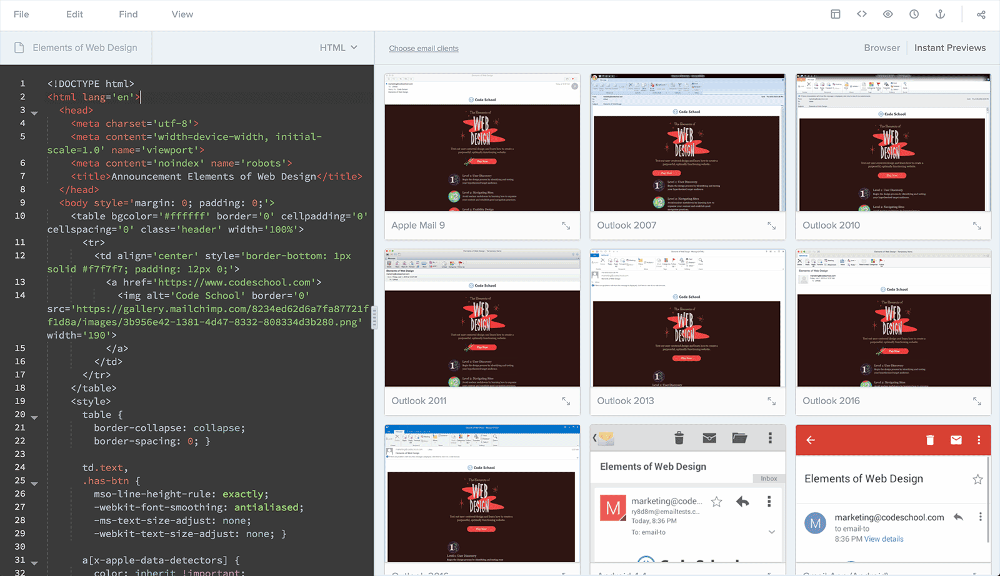
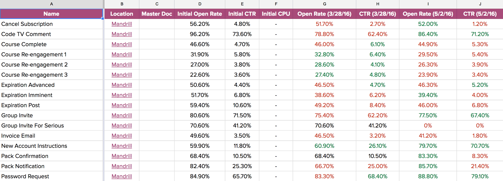
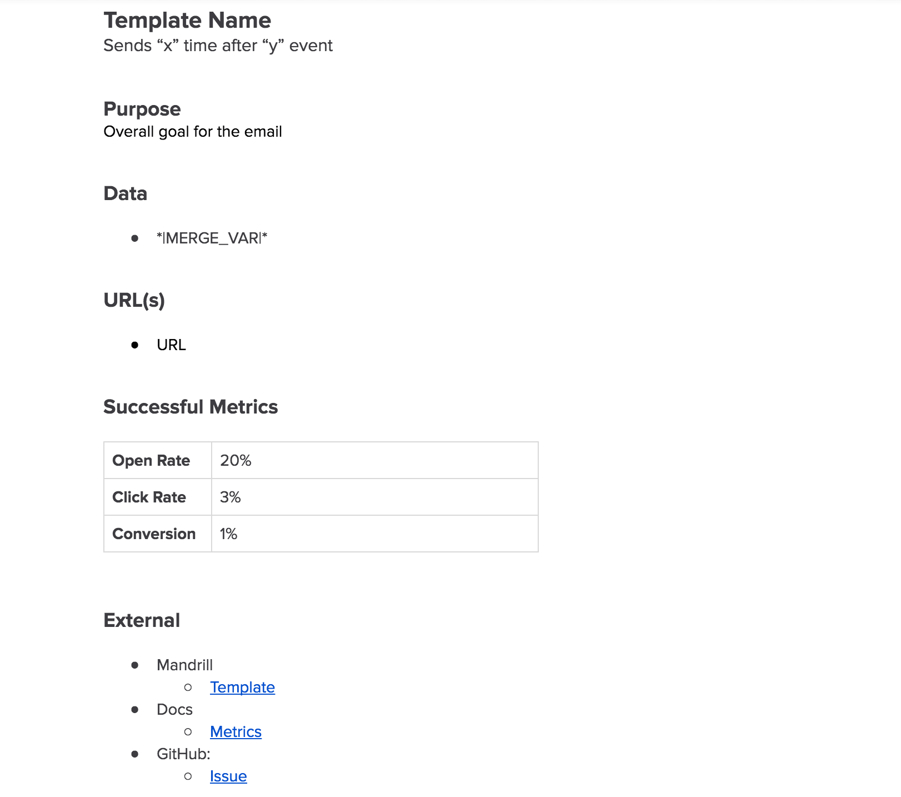
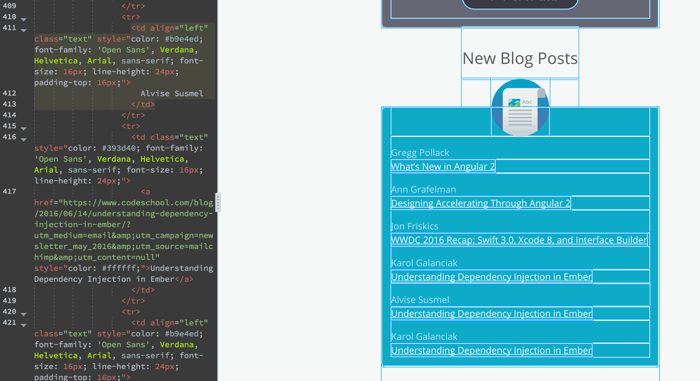

<!-- 
<svg class="mask-tri" data-name="Layer 1" xmlns="http://www.w3.org/2000/svg" xmlns:xlink="http://www.w3.org/1999/xlink" width="100%" viewBox="0 0 1002 216"><title>rethinking</title><g style="clip-path:url(#clip-path)"><text transform="translate(145 136.67)" style="font-size:118.29645538330078px;fill:#616f7d;font-family:'canada-type-gibson' serif;font-weight:700">RETHINKING</text></g></svg>
 -->

<section class="row nudge post-wrap">

<!-- <article><svg id="Layer_1" data-name="Layer 1" xmlns="http://www.w3.org/2000/svg" width="100%" viewBox="0 0 669.63 72.74"><title>my-emmail-workflow</title><text transform="translate(0 58.43)" style="font-size:63.5px;fill:#616f7d;font-family:'canada-type-gibson' serif;font-weight:700">My eMMail Workflow</text></svg> -->

In 2015, I was lucky enough to get to share [The Organized Chaos of Email](https://speakerdeck.com/dandenney/the-organized-chaos-of-email-creation) Creation at [The Email Design Conference](https://litmus.com/conference). While I was on stage talking about an offline workflow, people from the Litmus team were in the lobby demoing a game-changer: live client previews built into [Builder](https://litmus.com/email-builder).

It instantly became a part of my workflow and since then I don't send an email without it. (Well I have, but it ended up borked in Gmail, sooo.) In my talk, I touted the benefits of building offline in a Middleman app I dubbed [eMMail](https://github.com/dandenney/eMMail). The perks of doing so were reusable variables, partials, and custom reporting. Throughout the year, the Litmus folks have added a couple of those into Builder as well.

Variables have other uses but are super handy for setting analytics trackers throughout your links, [which they added](https://litmus.com/help/testing/litmus-builder-guide/#tracking-manager). Plus, the on-the-fly CSS inlining removes a lot of the need for variables if you're using classes.

I had access to the Partials beta and they're now live for everyone and working well. This was the big one for me as I maintain 40+ transactional emails. When something needs to change in our header or footer, it has to change in every file. This was the primary reason I was using Middleman and it's in Builder now.

I doubt they'll tackle the reporting bit anytime soon since that's more related to your ESP, but I hit a wall with mine. I want historical data to show performance of an email over time and that isn't straight-forward when hijacking the frontmatter in Middleman. It's super easy and readable in a Google Docs spreadsheet, though.

## I'm Out of Excuses

At this point, I don't have any excuses left to be building/maintaining my own system. Every email I create now ends up in Builder, so it makes sense to just start there. There's only a few small trade-offs: no Haml/Sass, no global variables, and I have to be online to build.

I've been debating dropping Haml and Sass since it's hard to share my code with others who don't use them. Variables can mostly be handled by classes and snippets and I've built a handful of emails without them already. I do a fair amount of traveling so the online bit will require a little bit of maneuvering, but I already have it covered in the flow adjustments.

## My New Flow

As always, this is a work-in-progress. I'm a couple months in to the tracking portion and only a few weeks into the building. Things will change but it's been feeling gooooood.

### Create a Master Doc

In studying successful product teams, I've found that most of them document projects (features, campaigns, etc.). I also saw that our teammates at Pluralsight create great kickoff docs for email campaigns. So I kind of made a frankenbaby of them for each of our emails. (I have not gone through and done them for all existing emails yet, but it's a bucket list item.)

These docs become increasingly important as we are doing more event-driven transactional emails. It is super easy to lose track of them and for only 1-2 people to know how they work. Writing the docs is mundane but an excellent feature for your team.

### Build and Organize in Builder

Each email starts in Builder and I'm slowly cleaning up my folders. I was pretty haphazard about them before because I was primarily using it for testing right before sending. Now that I need to be able to access emails for updates, so organization is a major key to success.

Each email starts with my [base snippet](https://litmus.com/community/snippets/86-base) and then I build using a series of snippets. Here's what the base looks like:

<iframe src="https://litmus.com/builder/7b54bd1/embed" scrolling="no"></iframe>

Another unexpectedly useful feature is the grid view. Enabling it outlines all of your tables and clicking in the preview takes you to that bit of code. It's a popular feature in some editors and I've grown to love it. It's at least 10 times faster than scrolling through code for edits.

### Present and Iterate in Builder

Each email goes through an internal review process. It's usually 3 of us: our marketing lead, copywriter, and me (but it can include lots of people). I had been handling previews and changes by editing locally, running a build, and deploying to GitHub pages. Now, I can make changes that are instantly viewable in the shareable URLs.

As an example, I pop something like this into our #cs-emails channel in Slack:

> Draft for the Angular 2 announcement, pending copy review: [https://litmus.com/builder/95c2a75](https://litmus.com/builder/95c2a75)

There's also a benefit that I hadn't planned on: anyone can grab the code. Since Corey (our marketing lead) handles the actual sends, this has reduced the need for him to occasionally remind me to "pop the code into MailChimp".

As an example, this was our most recent one:

<iframe src="https://litmus.com/builder/95c2a75/embed" scrolling="no"></iframe>

### Track in Google Docs

Reporting must be the hardest thing for ESPs to perfect. I'm sure I'm not alone in having specific metrics that I'm interested in, but it's unlikely that I want them the same way and for the same time ranges as others. I've found that creating my own reports is the most efficient and something about manually handling the data imprints it in my brain so I can remember stats to share with the team. Our team works heavily in Google Drive so I actually brought it to them instead of having them use my GitHub pages reports, too.

### Backup in GitHub

This is vital. I have great faith in the Litmus team, but we're all one major server failure away from losing things. Once an email is sent, edited, or in production as a transactional, I commit a copy to our emails repo. I also keep this repo locally which will handle my offline needs. I'll always be able to get one going offline using a prior email as a starting ground.

### My Wishlist

The Litmus team have covered most of my needs already, but I have a couple small things I'm hoping for. I'll keep my fingers crossed for a few small code formatting things (2 spaces as tabs) and some kind of variables. The formatting is just my pickiness, but the variables could alleviate an issue. I have been so reliant on a Haml one that puts the URL into both spots for bulletproof buttons and I sent one with a dud in the MSO button this week. Eek. A couple more emails and putting it in both will be my new muscle memory, though.

### And Then I Emailed Happily Ever After...

If you are an #emailgeek, [@dandenney](http://twitter.com/dandenney) if you have things that you do that could help me improve or if you have questions!

</article>

</section>